# JBmarks — Service Delivery in Motion (SDiM)

## Full System Technical Documentation

**Document Version:** 1.0  
**Date:** June 2026  
**Classification:** Internal Technical Reference  
**Prepared by:** T3 Systems

---

## 1. Executive Overview

**JBmarks** is a mobile and web platform built on **Service Delivery in Motion (SDiM)** — an enterprise work management system providing task tracking, team collaboration, messaging, calendar management, activity feeds, and analytics.

| Component | Platform | Purpose |
|-----------|----------|---------|
| JBmarks Android App | Android (Kotlin/Compose) | Primary mobile interface for field users |
| JBmarks Reports | Web (Next.js/React) | Analytics and reporting dashboard |
| JBmarks API Server | Node.js (Railway) | Backend proxy for auth + push notifications |

All data — tasks, users, calendar events, chats, and activity feeds — is stored and managed in the **SDiM platform** at `jbmarks.sdinmotion.co.za`.

<div class="page-break"></div>

## 2. System Architecture

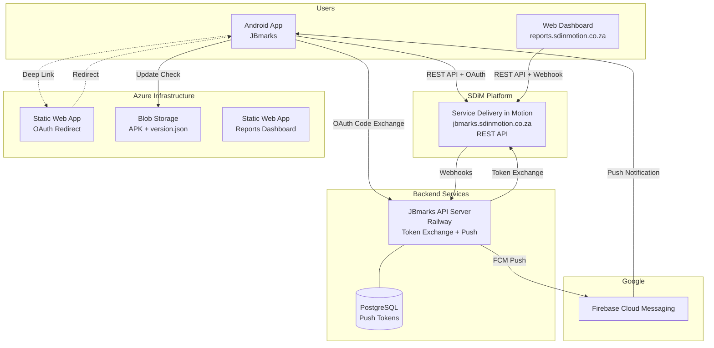

<div class="page-break"></div>

## 3. How SDiM Works — Core Concepts

### 3.1 API Structure

All API calls follow the pattern:

```
POST https://jbmarks.sdinmotion.co.za/rest/<method>.json?auth=<access_token>
```

### 3.2 Authentication Methods

| Mode | Format | Use Case |
|------|--------|----------|
| OAuth 2.0 | `?auth=<access_token>` on every request | Mobile app (user-specific) |
| Webhook | URL: `/rest/<userId>/<token>/` | Reports dashboard (shared read) |

### 3.3 Permissions Model

SDiM enforces role-based access automatically. When a user requests tasks, only these are returned:

- Tasks where user is **Responsible** (assigned to)
- Tasks where user is the **Creator**
- Tasks where user is an **Accomplice** (co-worker)
- Tasks where user is an **Auditor** (observer)
- Tasks in **Workgroups** the user belongs to

### 3.4 Workgroups

| Role Code | Display Name | Permissions |
|-----------|--------------|-------------|
| A | Owner | Full control |
| E | Moderator | Manage members + tasks |
| K | Member | View + work on tasks |

### 3.5 Pagination

SDiM returns **50 records maximum per request**. Full retrieval requires looping:

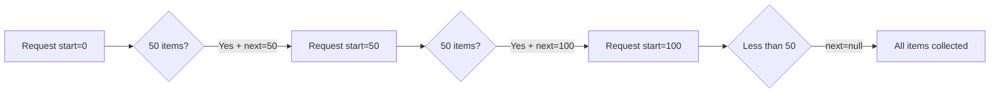

<div class="page-break"></div>

## 4. Authentication & Security

### 4.1 OAuth 2.0 Authorization Code Flow

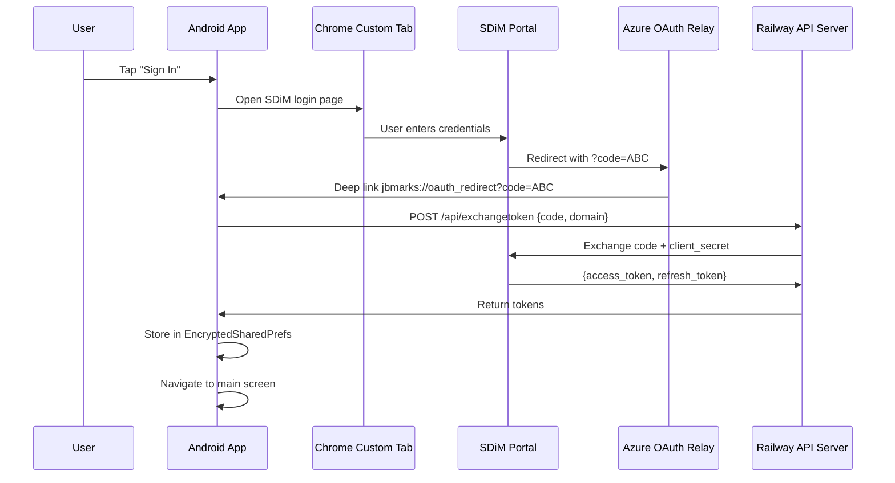

### 4.2 Token Storage

| Asset | Storage | Encryption |
|-------|---------|------------|
| Access Token | EncryptedSharedPreferences | AES-256-GCM (Keystore) |
| Refresh Token | EncryptedSharedPreferences | AES-256-GCM (Keystore) |
| Portal URL | EncryptedSharedPreferences | AES-256-GCM (Keystore) |
| Client Secret | Railway server env vars | Server-side only |

### 4.3 Token Refresh Flow

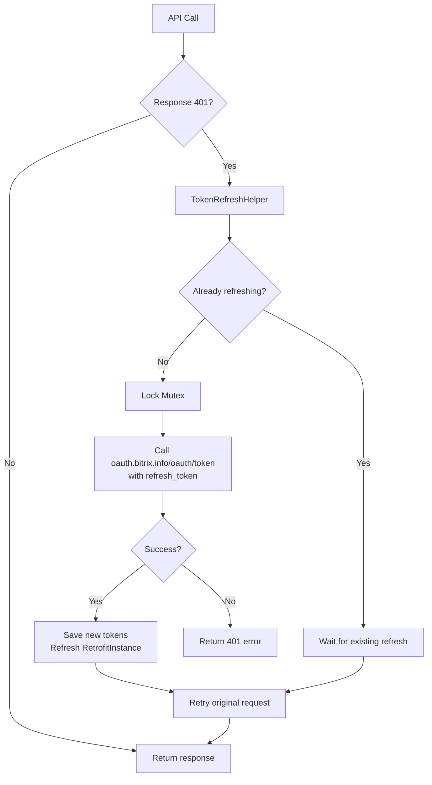

<div class="page-break"></div>

## 5. Mobile Application — Features

### 5.1 App Startup Flow

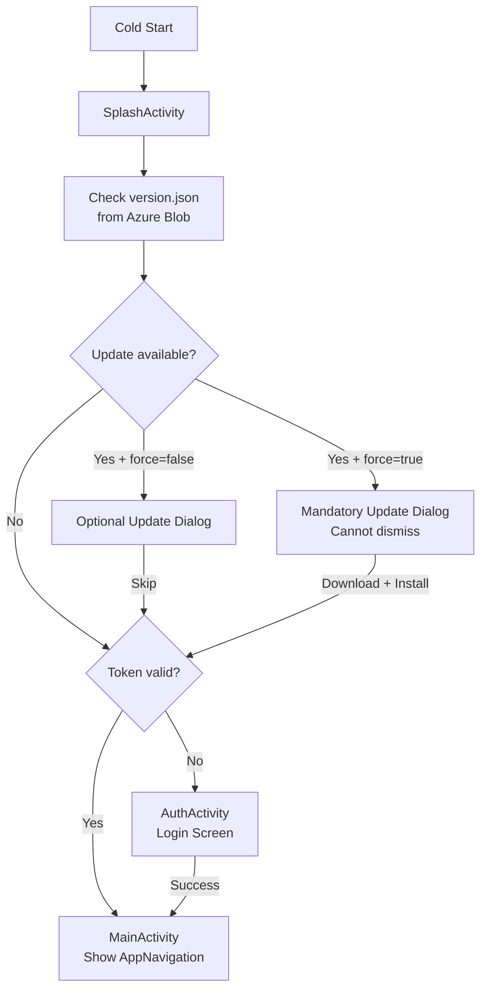

### 5.2 Navigation Structure

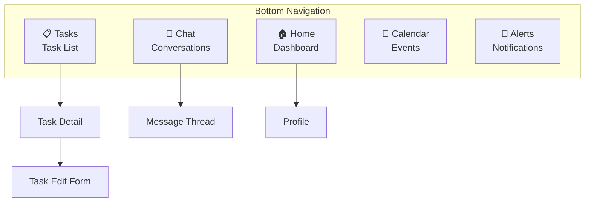

### 5.3 Dashboard Stats

| Metric | Source | Calculation |
|--------|--------|-------------|
| Active Tasks | `tasks.task.list` | Count where status ≠ Completed |
| Completed Tasks | `tasks.task.list` | Count where status = Completed |
| Unread Messages | `im.recent.get` | Sum of unread counts |
| Upcoming Events | `calendar.event.get` | Count of events |
| Pending Invitations | `sonet_group.user.groups` | Workgroup invites |
| Recent Activity | `log.blogpost.get` | Last 5 feed posts |

<div class="page-break"></div>

## 6. Task Management — Full Lifecycle

### 6.1 Task State Machine

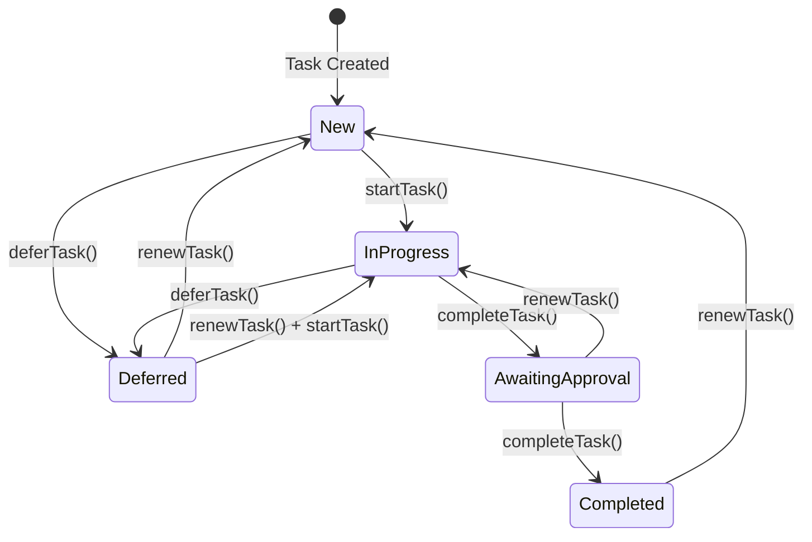

### 6.2 Task Operations

| Operation | API Endpoint | Description |
|-----------|-------------|-------------|
| List all | `tasks.task.list` | Paginated, all accessible tasks |
| Get detail | `tasks.task.get` | Full task with files + nested objects |
| Create | `tasks.task.add` | New task with fields |
| Update | `tasks.task.update` | Partial update |
| Delete | `tasks.task.delete` | Permanent removal |
| Start | `tasks.task.start` | → In Progress |
| Complete | `tasks.task.complete` | → Completed |
| Defer | `tasks.task.defer` | → Deferred |
| Reopen | `tasks.task.renew` | → New |
| Delegate | `tasks.task.update` | Change RESPONSIBLE_ID |

### 6.3 Task Sub-features

| Feature | API Methods | Description |
|---------|-------------|-------------|
| Comments | `task.commentitem.getlist`, `task.commentitem.add` | Discussion thread per task |
| Checklists | `task.checklistitem.*` (getlist, add, update, renew) | Sub-task checklist items |
| Time Tracking | `task.elapseditem.*` (add, getlist, update) | Log hours against task |
| File Attachments | `disk.storage.uploadfile`, `disk.file.get`, `disk.attachedObject.get` | Upload and attach documents |
| Delegation | `tasks.task.update` + `sonet_group.user.get` | Reassign to workgroup member |

### 6.4 File Upload Flow

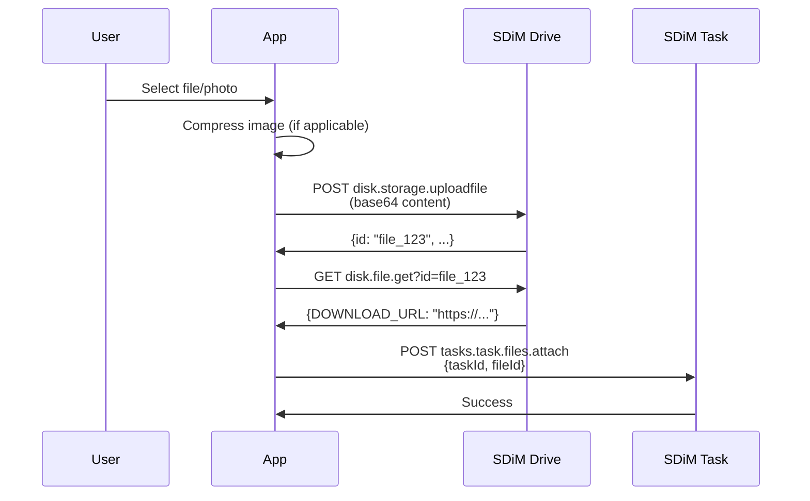

<div class="page-break"></div>

## 7. Notifications System

### 7.1 Dual Architecture

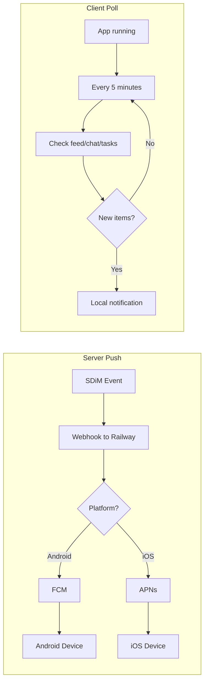

### 7.2 Notification Types

| Type | Trigger | Priority |
|------|---------|----------|
| TASK_ASSIGNED | New task created for user | HIGH |
| TASK_UPDATED | Task modified | NORMAL |
| TASK_COMMENT | New comment on user's task | NORMAL |
| TASK_DEADLINE | Approaching/missed deadline | HIGH |
| TASK_STATUS_CHANGED | Status transition | NORMAL |
| FILE_ATTACHED | File added to task | LOW |
| FEED_POST | New activity feed post | NORMAL |
| CHAT_MESSAGE | New message in conversation | HIGH |

### 7.3 Push Token Registration

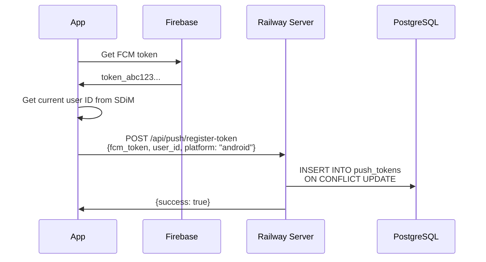

<div class="page-break"></div>

## 8. Reports Dashboard

### 8.1 Report Types

| Report | Key Metrics | Charts |
|--------|-------------|--------|
| Task Summary | Total, Active, Completed, Overdue, Completion % | Donut (status), Bar (priority), Horizontal bar (by group) |
| Overdue & Deadlines | Overdue count, Due this week, No deadline, Avg days overdue | Severity bar, Overdue by person |
| Time Tracking | Total hours, Tasks with time, Efficiency % | Actual vs Estimate bar, Time by group pie |
| Team Workload | Team size, Active tasks, Avg per person, Overdue | Stacked bar (per person), Completion % progress bars |

### 8.2 Export Formats

| Format | Contents |
|--------|----------|
| Excel (.xlsx) | Data table with auto-sized columns |
| PDF | Branded document: green header with logo, formatted table, page footer |

### 8.3 Hosting

- **URL:** https://reports.sdinmotion.co.za
- **Platform:** Azure Static Web Apps (Free tier)
- **Auth:** Pre-configured webhook (auto-connects, no login required)

<div class="page-break"></div>

## 9. Backend Services

### 9.1 Railway API Server

| Endpoint | Method | Purpose |
|----------|--------|---------|
| `/api/exchangetoken` | POST | OAuth code → token exchange (adds client_secret) |
| `/api/push/register-token` | POST | Store APNs/FCM device token |
| `/api/push/send` | POST | Send push to specific user |
| `/api/bitrix/webhook` | POST | Receive SDiM events → fan out push notifications |
| `/api/push/token/:user_id` | DELETE | Remove push token |
| `/health` | GET | Health check |

### 9.2 Database Schema

```sql
CREATE TABLE push_tokens (
    id           SERIAL PRIMARY KEY,
    user_id      VARCHAR(255) NOT NULL,
    apns_token   TEXT,
    fcm_token    TEXT,
    platform     VARCHAR(10) DEFAULT 'ios',
    portal_url   VARCHAR(500),
    created_at   TIMESTAMP DEFAULT CURRENT_TIMESTAMP,
    updated_at   TIMESTAMP DEFAULT CURRENT_TIMESTAMP,
    UNIQUE(user_id, apns_token),
    UNIQUE(user_id, fcm_token)
);
```

### 9.3 Webhook Event Handling

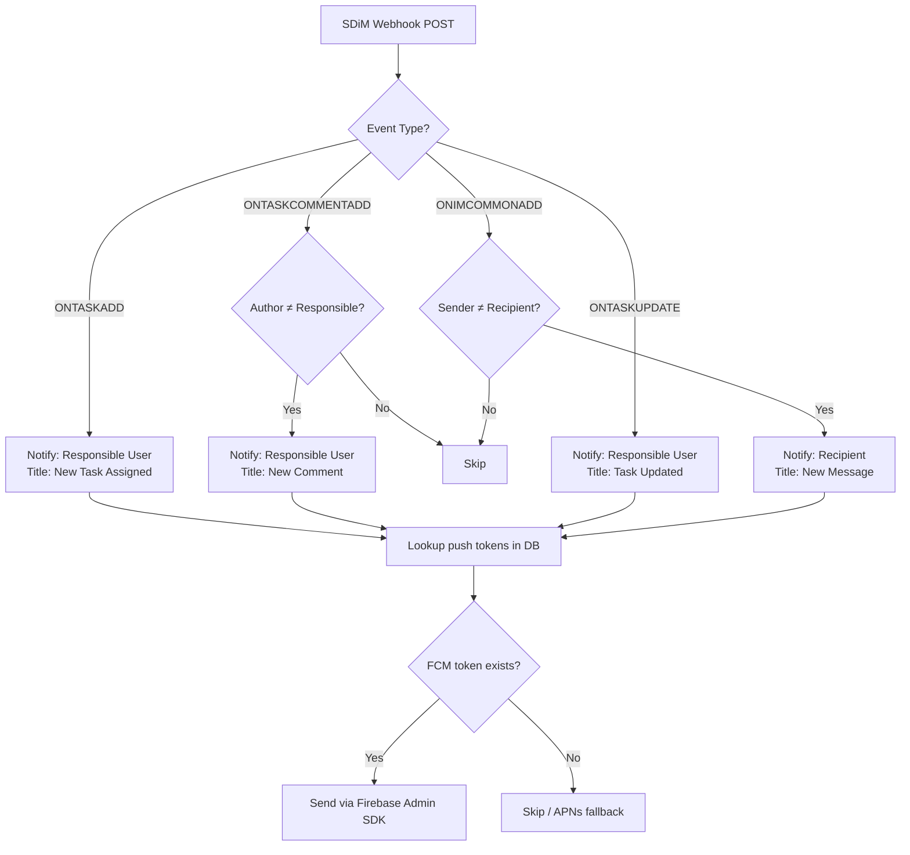

<div class="page-break"></div>

## 10. Data Models

### 10.1 Task

| Field | Type | Description |
|-------|------|-------------|
| id | String | Unique identifier |
| title | String | Task name |
| description | String | Full description (BB-code) |
| status | Enum | NEW / IN_PROGRESS / AWAITING_APPROVAL / COMPLETED / DEFERRED |
| priority | Enum | LOW / NORMAL / HIGH |
| deadline | DateTime? | Due date |
| createdDate | DateTime? | Creation timestamp |
| closedDate | DateTime? | Completion timestamp |
| responsibleId | String? | Assigned user ID |
| responsibleName | String? | Assigned user display name |
| createdBy | String? | Creator user ID |
| groupId | String? | Workgroup ID |
| groupName | String? | Workgroup name |
| commentsCount | Int | Number of comments |
| tags | List | Labels |

### 10.2 User

| Field | Type | Description |
|-------|------|-------------|
| id | String | User ID |
| name | String | First name |
| lastName | String | Last name |
| email | String? | Email address |
| photoUrl | String? | Profile photo URL |
| position | String? | Job title |

### 10.3 Notification

| Field | Type | Description |
|-------|------|-------------|
| id | String | Notification ID |
| type | Enum | TASK_ASSIGNED / TASK_COMMENT / CHAT_MESSAGE / etc. |
| title | String | Notification heading |
| message | String | Body text |
| timestamp | Long | Unix milliseconds |
| isRead | Boolean | Read state |
| priority | Enum | LOW / NORMAL / HIGH / URGENT |
| relatedId | String? | Task/chat ID for navigation |

<div class="page-break"></div>

## 11. Deployment & Distribution

### 11.1 Android App Release Process

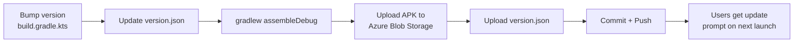

### 11.2 Infrastructure

| Service | Provider | Region | Cost |
|---------|----------|--------|------|
| SDiM Portal | Managed | South Africa | Included |
| API Server | Railway | Auto | Free tier ($5/mo credit) |
| Reports Web | Azure Static Web Apps | East Asia | Free tier |
| OAuth Redirect | Azure Static Web Apps | SA North | Free tier |
| APK Storage | Azure Blob Storage | SA North | Minimal |
| Push Notifications | Firebase (FCM) | Google | Free |

<div class="page-break"></div>

## 12. Security Architecture

### 12.1 Security Controls

| Layer | Control | Implementation |
|-------|---------|---------------|
| Token at rest | Encrypted storage | AES-256-GCM via Android Keystore |
| Token in transit | HTTPS only | TLS 1.2+ on all connections |
| Client secret | Server-side only | Stored in Railway env vars, never on device |
| Token refresh | Mutex-guarded | Single concurrent refresh to prevent storms |
| Push tokens | Database isolation | Per-user storage, auto-cleanup of invalid tokens |
| API access | Role-based | SDiM enforces permissions per authenticated user |
| App updates | Version check | version.json manifest, optional force-update |

### 12.2 API Call Authentication Flow

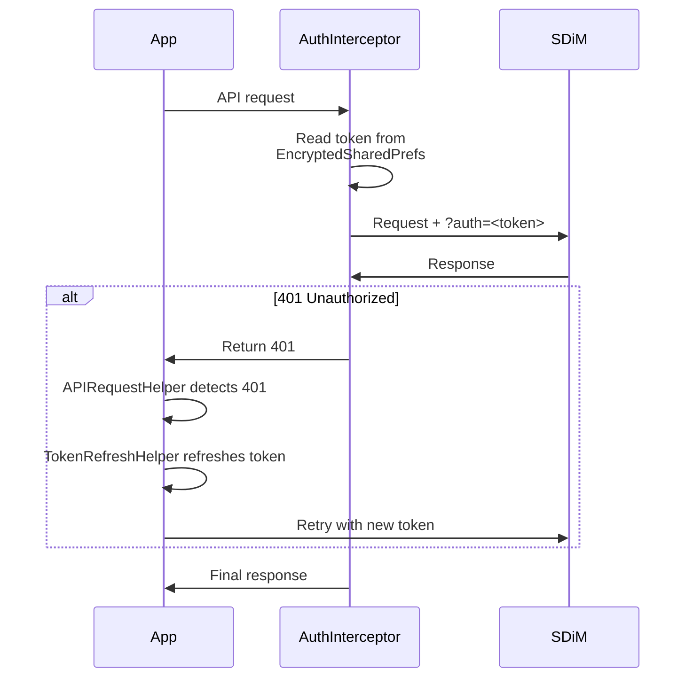

---

## Appendix A: SDiM API Scopes

```
crm, task, tasks_extended, calendar, user, user_brief, user_basic,
sonet_group, bizproc, log, placement, entity, disk, mailservice,
lists, calendarmobile, tasks, tasksmobile, im
```

## Appendix B: Task Status Codes

| Code | Status | Description |
|------|--------|-------------|
| 2 | New | Created, not started |
| 3 | In Progress | Work actively underway |
| 4 | Awaiting Approval | Marked done, pending supervisor review |
| 5 | Completed | Fully done |
| 6 | Deferred | Postponed |

---

*This document reflects the system state as of June 2026.*  
*For updates or corrections, contact T3 Systems.*
